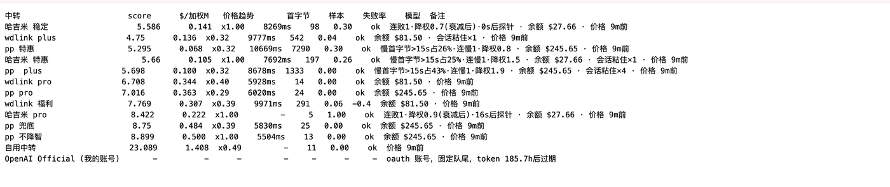
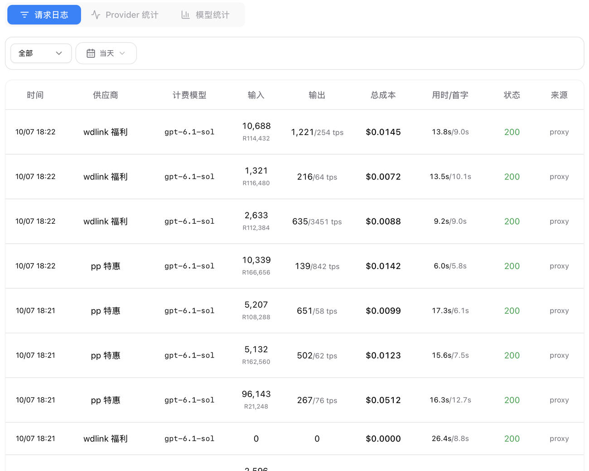
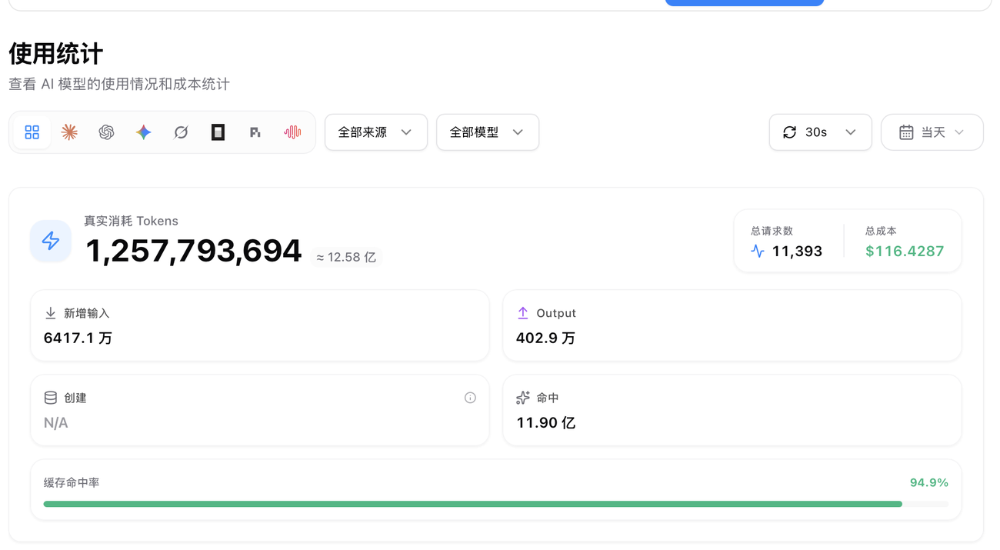
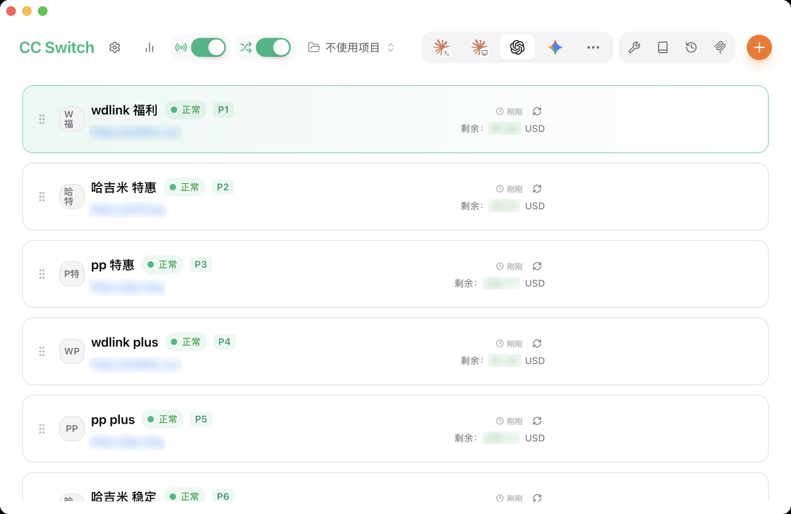
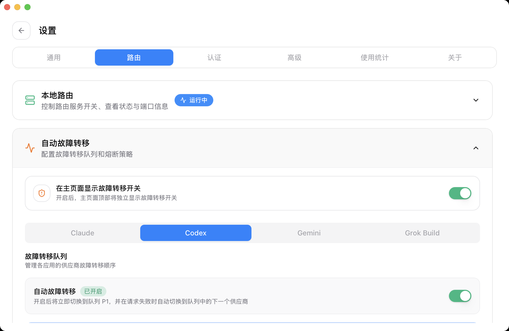
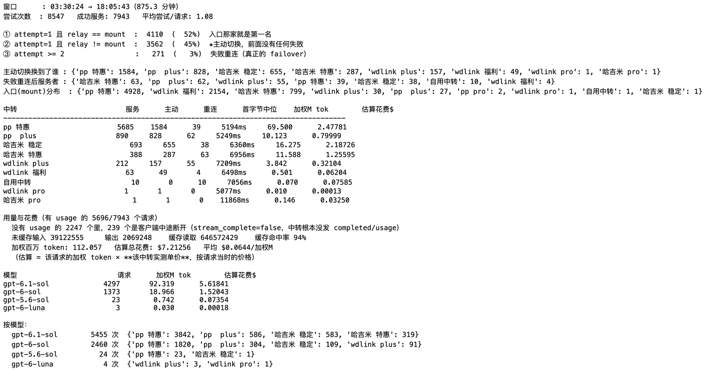
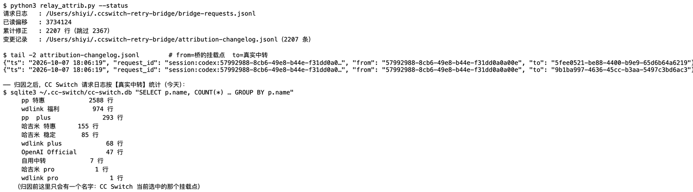
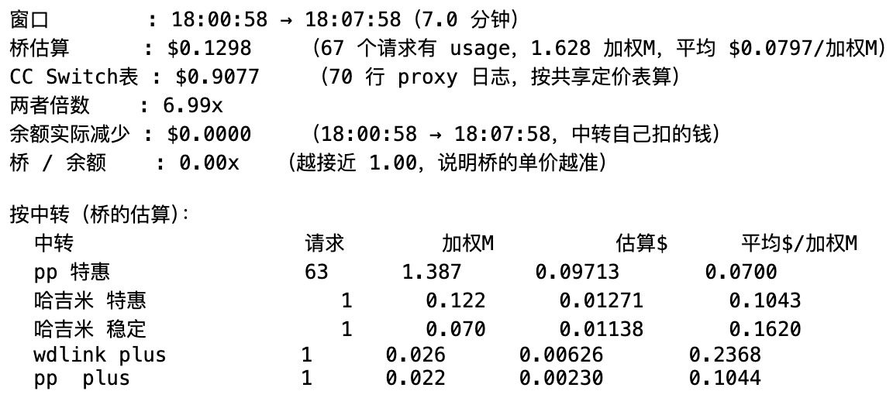

# codex-relay-toolkit

两个小工具，用来让 **Codex** 跑在**第三方中转 / 代理供应商**上（就是那种把
`base_url` 指过去、OpenAI 兼容的中转），也可以配合
[CC Switch](https://github.com/farion1231/cc-switch) 的本地代理使用。

做这两个工具，是因为有两个可复现的缺口：

| 缺口 | 后果 |
|---|---|
| Codex 只重试它能分类的错误。中转发回 `HTTP 400 {"error":{"type":"upstream_error"}}`（很多中转在自己上游抖动时就是这么回的）会被归到 `codex_error_info: "other"`，**不会重试** —— 即使把 `request_max_retries` 设成 20 也没用 | 一个回合直接失败，而不是被重试 |
| CC Switch 的代理会在连接错误、404、5xx 上做故障转移，但把 `400` 当成**客户端错误**原样透传；而且它**每个请求对每个供应商只试 1 次**（实测：即使 `max_retries = 40`，日志也是 `已尝试 10/10 个 Provider`）| 中转的错误原样冒到最上层；调大 `max_retries` 完全无效 |

`bridge.py` 补上这两个缺口。`watchdog.py` 与网络无关：它负责把**异常结束、
且 Codex 自带 goal 引擎没有接管**的会话续跑起来。

> 与 `codex-relay` / `model-hotel` / `codex-proxy` / `LiteLLM` 等项目的逐项对标、
> 借鉴了什么、明确不抄什么、下一步做什么：见 [docs/ROADMAP.md](docs/ROADMAP.md)。

```
Codex ──► CC Switch 代理 ──► 重试桥 ──► 中转 A
   （或 ────────────────────► 重试桥）   中转 B
                                        …          ← 轮询，最多 N 次
                                        自己的 ChatGPT 账号（最后兜底）
```

---

## 实际效果（2026-10-07 实机截图）

**① 桥的实时排名** —— `GET /__bridge/status?text=1`：



每一列都是**实测**出来的，不是配置里写的：`score`（综合分，越小越优先）、
`$/加权M`（这家自己的真实单价，来自它的 `/v1/usage` 账单）、`价格趋势`、
`首字节`（按模型统计的中位首字节）、`样本`、`失败率`。备注列会把当前生效的机制都写出来：
`连败1·降权0.7(衰减后)·0s后探针`、`慢首字节>15s占25%·连慢1·降权1.5`、
`余额 $245.65`、`会话粘住×4`、`价格 9m前`；兜底账号固定队尾并显示 token 余期。

**② CC Switch 的请求日志**（设置 → 使用统计 → **请求日志**）—— 注意「供应商」列：



桥接管路由后，CC Switch 自己记录的只可能是它发出去的那个地址（桥的挂载点），
所以这一列原本永远是同一个名字。`relay_attrib.py` 用响应的 `response_id` 精确匹配，
把它改写成**真正服务这次请求的中转** —— 图里这一列在 `wdlink 福利` / `pp 特惠` 之间交替，
也就是**桥正在换家**的直接证据（最后几行的 `用时/首字` 还能看到 `17.3s/6.1s` 这种慢首字节）。

同一页还有 **Provider 统计 / 模型统计** 两个视图，以及顶部总览：
**总请求 11,393 / 总成本 $116.4287 / 缓存命中率 94.9%**。



这个 94.9% 与桥自己算的 94% 互相印证；而它的「总成本」用的是**共享定价表**，
与桥按各家实测单价算出来的数字差一个数量级 —— 这正是下面 ③ 要对账的原因。

**③ 供应商列表**（`P1…P12` 就是故障转移的优先级，拖拽排序）：



这一页是**桥的上游池**：健康状态、优先级、余额（图中余额数字做了打码）。
注意这里显示的是各家中转自己的域名 —— 真正写进 Codex 配置的 `base_url` 已经被 `setup.py`
改成了桥的挂载点（`127.0.0.1:15888/p/<id>`），所以链路是
**Codex → CC Switch 代理 → 桥 → 池子里的某一家**。也正因为如此，谁排在 `P1` 只影响
CC Switch 自己的选择，**桥内部还有一套按实测单价/延迟的排序**（图 ①）。

**④ 路由设置：自动故障转移（Codex）**：



CC Switch 这一层有自己的重试、超时（默认流式首字节 180s）和熔断策略；桥在它后面又做了一套
更细的：自适应排序、失败降权（连败立刻降权 + 衰减恢复 + 探针保底）、首字节 >15s 降权、
熔断与配额/余额 park。两者互不冲突：CC Switch 负责"这个供应商整个不通了换下一个"，
桥负责"在都通的情况下选最便宜最快的，并且别把好中转打死"。

---

## 统计与证据（都是真实输出）

README 里的数字不该只是"我声称"。下面三张是**实际跑出来的**：

**① 请求统计** —— `python3 request_stats.py`



关键三行就是"又便宜又快"的量化证据：
**① 52% 入口那家本来就是第一名；② 45% 是主动切换（前面没有任何失败）；③ 只有 3% 是失败重连**。
下面按中转列出服务次数、主动切换次数、失败重连次数、首字节中位、加权 token 与估算花费；
缓存命中率 94%，估算总花费 $7.21（按**各家自己的实测单价**，见 `request_stats.py` 的口径说明）。

**② 归属证据** —— `relay_attrib.py --status` + 变更记录 + CC Switch 库里的分布



累计改写 2207 行：`from` 是桥的挂载点、`to` 是真正服务的中转（用响应的 `request_id` 精确匹配）。
改写之后，CC Switch 自己的请求日志里能看到 9 家中转；其中 **`OpenAI Official 47 行`**
正是 2026-10-07 那次"流量绕过桥"（11:04–13:28 直连官方账号）留下的记录 —— 归因让这件事也留了痕。

**③ 成本口径对账** —— `python3 reconcile.py`



同一窗口的三组数字：**桥的估算**（各家实测单价 × token）、**CC Switch 自己的表**
（共享定价表）、以及**余额实际减少**（中转自己扣的钱，唯一的地面真相）。截图那次
59 分钟窗口里：桥估算 **$1.4831**、CC Switch 表 **$9.7757**（6.6 倍）、
余额实际减少 **$1.5302** —— **桥/余额 = 1.03**，桥的单价误差只有 3%。

这就是当初发现"单价被低估约 4 倍"的方法：桥估算与余额对不上，于是去掉 `trend` 乘算、
改用历史每模型单价，误差落回百分之几。台账按**账号**聚合（`pp` 那 5 家中转共用一个钱包，
分开算会互相干扰），标签只用中转名、不出现域名。三边的量级差别也直接肉眼可见：
CC Switch 总览里的「总成本 $116.43」（共享定价表）≫ 桥的实测估算。
`reconcile.py --sample` 已在 launchd 里每 15 分钟采一次余额
（所以窗口越长这项越有意义；刚采样的短线窗口里中转还没扣费，会看到 `$0.0000`）。

## 一、重试桥（`bridge.py`）

一个零依赖的 HTTP 代理，**自己拥有重试循环**。

* **轮询所有已配置的中转**，每个请求最多 `BRIDGE_ATTEMPTS` 次（默认 100），
  从 CC Switch 选中的那个供应商开始。
* **重试这些**：`upstream_error` 信封、401/403/404/405、408/425/429、5xx，
  以及连接 / TLS / 读取失败。
* **其余原样透传** —— 真正的客户端错误不会被放大成重试风暴。
* **每次尝试都用该中转自己的 key 重新签名**，所以不同 key 的中转可以混着放。
* **拿到第一个字节才算"落定"。** 中转接受了请求却卡住或直接断开时，
  换下一家重试，而不是把一条截断的流丢给客户端。超时顺序保证桥**早于**上层发现：
  首字节 `50s` < CC Switch 的 `streaming_first_byte_timeout`。
* **按错误类型分别退避。** 连接 / TLS 类失败是成簇出现的（VPN 或隧道重载），
  而且**所有中转会同时失败**，所以给它们指数退避（上限 `BRIDGE_NET_BACKOFF_MAX`），
  让请求有机会熬过这段抖动；HTTP 类错误仍然快速轮询。
* **自己的 ChatGPT 账号作为最后兜底**（`auth_type: "oauth"`），
  **每次尝试都重新读** `~/.codex/auth.json`，不做缓存 ——
  缓存被轮换过的 token，正是"发出一个已吊销 token"的经典原因。
* **为官方后端归一化请求体。** 官方 Codex 后端要求 `input` 是数组
  （否则返回 `{"detail":"Input must be a list"}`），而中转容忍字符串。
  没有这一步，账号兜底会**静默失效**。
* **按中转能力自动适配模型。** 中转上新模型的节奏不一致，客户端要的模型某家没有时，
  桥会查该中转的 `/v1/models`，自动换成**它支持的、同家族里版本最高**的那个
  （例如客户端要 `gpt-6.1-sol`、某中转只有 `gpt-6-sol`，就自动降一级用它的），
  而不是直接吃一个 404 白耗一次轮询。模型列表按 `BRIDGE_MODELS_TTL` 缓存（默认 30 分钟）。
  如果该中转整个家族都没有，则不改写、按原样发出去。
* **顺序不是固定的：按「价格 + 实测速度」动态排。** 见下一节。

### 动态排序：又便宜、又快

`routes.json` 里的 `order` 只是**初始顺序**。运行期每个中转都会被打分，分数只来自能观测的东西：

| 维度 | 来源 |
|---|---|
| 价格 | 中转自己 `/v1/usage` 报的 `actual_cost`，折算成**加权百万 token 单价**，后台每 `BRIDGE_PRICE_TTL`（默认 600s）刷新 |
| 速度 | 本机实测的**首字节时间**（每次请求更新 EWMA，**同时按「一天中的哪个小时」分开记**）|
| 稳定性 | 衰减的失败率：卡住不出字节、超时、5xx |
| 模型匹配 | 要的模型这家有没有（只用缓存的 `/v1/models`，打分绝不发网络请求）|

**价格和速度都是变量**，所以这里没有一次性标定，全部是「最近观测」：

* **价格取最近 `BRIDGE_PRICE_DAYS`（默认 3 天）的账单**，不是历史平均值。
  `/v1/usage` 的 `daily_usage` 给出每天的真实扣费，用它算出「最近 ÷ 历史」的趋势系数并**只作展示**。
  单价用**历史每模型实测单价**，不乘趋势 —— 2026-10-07 用真实余额对账发现：把趋势乘进单价后，
  pp/wdlink 两个账号的成本被低估约 4 倍（最近缓存占比高 → 摊薄了「最近 $/加权token」，
  单价其实没变），而**历史口径与余额实际扣费相差 20% 以内**。
* **超过 `BRIDGE_PRICE_MAX_AGE`（默认 6h）没更新过的价格直接不采信**，
  当作「没有数据」处理，而不是拿旧价格继续排。
* **速度按小时分桶**：`byhour` 里每个小时各自一条 EWMA，
  当前小时样本够 `BRIDGE_HOUR_MIN_SAMPLES`（默认 3）就优先用它，
  所以**高峰期慢下来只影响那个小时**，不会把这个中转一整天都压到底。
* **超过 `BRIDGE_LATENCY_MAX_AGE`（默认 30 分钟）没测过的速度同样不采信**。
* **每 `BRIDGE_EXPLORE_EVERY`（默认 50）个请求做一次探索**：把数据最陈旧的中转提到第一位重测一次。
  判定陈旧看的是「最后一次**尝试**」（成功或失败都算），所以一个永远失败的中转不会被当成
  「一直没测过」而每次都被翻上来；探索还带价格闸门
  （`BRIDGE_EXPLORE_PRICE_FACTOR`，默认只看最便宜的 2 倍以内）——
  价格变化本来就被后台 `/v1/usage` 刷新盯着，花请求去测一个贵 10 倍的中转快不快没有意义。
  这样「变快了/降价了」（或变慢/涨价）的中转能自己爬回来，而不是被一次坏运气永久埋掉；
  其余 49 个请求仍然老老实实走最便宜最快的那个。
* **从没测过的中转不会永远没有机会**：只要它的价格在「最便宜 × `BRIDGE_WARMUP_PRICE_FACTOR`
  （默认 2 倍）」以内，就先测它一次（每个这样的中转只多花一个请求）。
  否则「更快」永远无从谈起 —— 没人用过它，就永远不知道它快不快；
  而比最便宜的贵一倍以上的，不花这个钱去测。

规则：

* 分数越低越先试；**最便宜 + 最快 + 不需要降级模型**的排最前。
* 需要把模型降一级 → `+BRIDGE_MODEL_ADAPT_PENALTY`（默认 0.4）；整个家族都没有 → `+1.5`。
  **"便宜"永远不会悄悄变成"模型更差"。**
* 完全没有数据的中转按**中位数**参与排序（探索），不会因为没数据被打入冷宫，
  也不会凭空白嫖第一位。
* **会话粘性**：一轮对话里 Codex 每回合都会重发整段历史，桥按
  `session-id`/`thread-id` 头 → `prompt_cache_key` → `instructions`+首个输入项的哈希
  认出"同一个会话"，给**上一回合服务它的那家中转**加一个固定加成
  （`BRIDGE_AFFINITY_BONUS`，默认 0.75）。加成本身不会锁死：明显更便宜/更快的中转照样能赢；
  粘住的中转被熔断或消失时立刻放弃粘性。这样能保住上游的 **prompt cache**
  （以及有状态中转的会话上下文），也**不会**被预热/探索打断（有粘性时这两个让路）。
* **余额感知**：`/v1/usage` 刷新时顺带读回余额；低于 `BRIDGE_MIN_BALANCE`（默认 $1）
  就 park 这个中转（`BRIDGE_BALANCE_HOLD`，默认 1 小时），充值后自动解除 ——
  不用等打到没钱才失败。中转发出的天文数字（预付/无限套餐）按"无限制"处理。
* **按模型分别统计速度**：实测各家中转在不同模型上的首字节能差 1–4 秒，
  所以延迟按 (中转, 模型) 记录（样本够才启用，否则退回小时/总体）。结果是排序**按模型分化**：
  例如 `gpt-6.1-sol` 首选 pp 特惠，而 `gpt-6-sol` 首选哈吉米 稳定。
* 权重可调：`BRIDGE_W_PRICE`（默认 1.0）、`BRIDGE_W_LATENCY`（默认 **1.5**，速度）、
  `BRIDGE_W_FAIL`（默认 2.0，失败率）。分数是各维度归一化后的加权和，越小越好。
* 排序用上一次的顺序做稳定排序的种子，分数接近时不会来回抖动。
* **失败降权（立刻）+ 三重恢复机制**：一味"失败就压低"会让一次偶发失败把好中转钉死，
  所以降权与恢复是配套的：
  1. **立刻降权**：每多一次连续失败，分数直接加 `BRIDGE_W_FAIL_STREAK`（默认 1.0，
     上限 `BRIDGE_FAIL_STREAK_CAP`=3）——不必等缓动的失败率 EWMA，也不必等熔断（5 次）。
  2. **惩罚随时间线性衰减**：`BRIDGE_FAIL_STREAK_TTL`（默认 900s）内从 1 衰减到 0，
     即使这个中转一直没被重试，它也会**自己恢复**（不依赖任何请求）。
  3. **探针保底重试**：连败且超过 `BRIDGE_PROBE_AFTER`（默认 120s）没被尝试 → 直接提到队首试一次；
     间隔按连败次数**翻倍**（120s→240s→480s…上限 `BRIDGE_PROBE_MAX`=1800s），
     偶发抖动一分钟内就回来，反复失败的则少打扰但永不放弃。
  4. **一次成功全清**：`fails`、熔断、冷却、降权全部归零。
  客户端主动中断（Ctrl-C / 关连接）**不算失败**，不会降权（有端到端用例守着）。
  状态页会显示 `连败N·降权X(衰减后)·Ns后探针`。
* **首字节过慢也降权**（`BRIDGE_SLOW_TTFB`，默认 15s）：中位数会把长尾藏起来
  （某家 6s 中位、但 1/5 的请求让你等 20 秒），所以慢首字节单独算：
  1. **按发生率**（`BRIDGE_W_SLOW_TTFB`=2.0，EWMA α=`BRIDGE_SLOW_ALPHA`=0.25）：
     偶发一次只轻推，系统性慢则重罚，快速响应会把它衰减回去。
  2. **最近一次慢立刻降权**（`BRIDGE_W_SLOW_STREAK`=1.0，上限 `BRIDGE_SLOW_STREAK_CAP`=2，
     `BRIDGE_SLOW_STREAK_TTL`=300s 内线性衰减）：刚让你等 15s 的中转不会马上又被选中。
  3. **一次快速响应清零连慢**；且**慢 ≠ 失败**——不记失败、不熔断。
  只会用**流式首字节**判定（非流式的总时长不是首字节）；逐请求日志里带 `slow_first_byte` 便于复盘。
  实测基线：近 24h 6265 个请求里 **1.9%** 首字节 >15s，且集中（wdlink plus 7%、pp 特惠 2%）。

* 官方订阅账号（`auth_type: "oauth"`）**永远排最后**，仍然单独限次。
* `BRIDGE_ORDER_MODE=fixed` 可以退回原来的行为：从 CC Switch 选中的那家开始轮询。
  `BRIDGE_RESPECT_START=1` 则是「仍然从中转选中那家开始，其余按分数排」。
* **冷启动**：第一次没有价格数据时，第一个请求最多等 `BRIDGE_PRICE_WAIT`（默认 8s）
  拿到第一轮价格再排（`bridge-state.json` 里还有新鲜数据时不需要等）。

价格是**绝对价格**，不是折扣率：`actual_cost` 除以加权 token 量
（output 记 4 倍、cache_read 记 0.1 倍、cache_creation 记 1.25 倍），
这样缓存命中率不同的中转也能公平比较（否则缓存多的那家看起来永远更便宜）。

看当前排序：

```bash
curl -s "http://127.0.0.1:15888/__bridge/status?text=1"
```

```
中转                       score    $/加权M 价格趋势     首字节  样本 失败率  模型  备注
哈吉米 特惠                  1.21      0.144   x1.00     320ms    18   0.00    ok
wdlink 福利                  1.83      0.214   x0.85     480ms   240   0.00    ok
pp 特惠                     2.05      0.051   x1.40     690ms   310   0.00    ok
pp pro                     3.10      0.230   x1.00       ?ms     0   0.00    ok  价格 4m前
wdlink  deepseek4.1        ──  查询不到用量（key 已失效）
```

* `价格趋势`：最近 ÷ 历史（`x1.40` = 这家最近涨价了，**仅供参考**，不参与排序乘算）。
* 延迟用**最近 15 次样本的中位数**（每个模型单独统计），不是均值：长尾会把均值拖高
  （某家中位 6.4s、均值 8.0s），均值化会让所有中转看起来"一样慢"，速度权重就失效了。
* 备注列还会出现 `余额 $x`、`会话粘住×N`（当前有 N 个会话钉在这家）、`熔断 120s`。
* `样本`／`首字节` 是实测值，超过 `BRIDGE_LATENCY_MAX_AGE` 没再测到就显示 `-`（不采信）。

* 去掉 `?text=1` 就是 JSON；加 `&model=gpt-6.1-sol` 看指定模型的排序。
* 学到的延迟／失败率／价格存在 `bridge-state.json`（已 git 忽略），重启不用从零开始。
* 只在**本机**可访问（非回环地址直接 403）。
* 每次排序变化会在 `bridge.log` 里留一行 `ORDER ...`，方便回看它为什么这么选。

### 看清楚「这一次到底是谁服务的」

CC Switch 的请求日志只会记 **它把请求发给了谁**——也就是它选中那家 = 桥的入口。
桥在内部换成别家，它完全不知道（这是"动态排序"的必然结果，不是 bug）。
所以要看清真相得看桥自己的逐请求日志：

```bash
tail -f ~/.ccswitch-retry-bridge/bridge-requests.jsonl
{"ts":"2026-10-07 04:49:41","mount":"pp 特惠","relay":"pp  plus","model":"gpt-6.1-sol",
 "attempt":1,"status":200,"result":"ok","first_byte_ms":4435,
 "tokens":{"input":1366,"output":96,"cache_read":168704,"cache_creation":0,"total":170166},
 "price_per_m":0.03074,"est_cost_usd":0.000572}
```

`mount` = CC Switch 发给了谁，`relay` = 桥实际用了谁，`attempt` = 第几次尝试，
`result` = `ok`/`pass`/`retry`/`stalled`/`network-error`。

**`tokens` 来自中转自己返回的 `usage`**（`input` 是**未缓存**输入，即 `input_tokens`
减去 `input_tokens_details.cached_tokens`）；**`est_cost_usd` = 该请求的加权 token ×
`price_per_m`**，而 `price_per_m` 是**这家自己的实测单价**（见上文，历史每模型账单）。
所以这个金额是"这次请求在这家中转上实际该花多少"，比 CC Switch 的混合单价更接近真相。
流式响应里 usage 只在最后一个事件出现，桥用有界扫描（`UsageScanner`）解析，
不缓存整个响应；截断的 usage 一律丢弃，不会记半截数字。

文件到 5MB 自动轮转成 `.1`；`BRIDGE_REQUEST_LOG=0` 可关闭。`bridge.log` 的每行现在也带 `model=`。

**「主动动态调整」还是「失败重连」？以及花了多少钱：**

```bash
python3 request_stats.py                 # 默认读 ~/.ccswitch-retry-bridge
python3 request_stats.py --minutes 30
```

```
① attempt=1 且 relay == mount  :  1448  ( 73%)  入口那家就是第一名，没换
② attempt=1 且 relay != mount  :   504  ( 25%)  ★主动切换：前面没有任何失败
③ attempt >= 2                 :    42  (  2%)  失败重连（真正的 failover）

中转                          服务      主动      重连     首字节中位    加权M tok    估算花费$
pp  plus                   415     391      24     4435ms      0.248      0.01273
wdlink plus                 90      74      16     6070ms      0.000      0.00000

用量与花费（有 usage 的 17/1994 个请求）
  未缓存输入 19752   输出 4246   缓存读取 2111232   缓存命中率 99%
  加权百万 token: 0.248   估算总花费: $0.01273
```

**②才是"动态排序起作用"的证据**：请求在**第一次尝试**就发给了别家，不可能由失败触发。
③才是失败重连。

### 让 CC Switch 的请求日志显示真实中转（`relay_attrib.py`）

CC Switch 的「请求日志 / Provider 统计 / 模型统计」记的是**它把请求发给了谁**（桥的入口），
所以永远只有一家。但它那行的主键里带着中转返回的 response id：

```
request_id = session:codex:<它发去的 provider>:resp_xxxxxxxx
```

桥的 `bridge-requests.jsonl` 里既有 `response_id` 又有真正服务那家的 `relay_id`，
于是可以**精确到行**把归属改成真实值：

```bash
python3 relay_attrib.py --once            # 处理新请求
python3 relay_attrib.py --once --dry-run  # 只看会改什么
python3 relay_attrib.py --status          # 进度 / 已改多少行
python3 relay_attrib.py --rollback        # 按变更记录一键还原
```

后台常驻（每 30 秒一次）见 `launchd/com.local.relay-attrib.plist.example`。

规则与边界：

* **只改归属数据**（`proxy_request_logs.provider_id`），不动路由、不动金额、
  不碰 `data_source='codex_session'` 的会话同步行。
* 匹配靠 response id，**不会张冠李戴**；CC Switch 落库比响应晚一点，
  一时找不到的行会进重试队列（默认 15 分钟）而不是丢掉。
* 每次修改都追加到 `attribution-changelog.jsonl`，`--rollback` 按它还原。
* 只修正**桥重启之后**的请求（更早的行没记 response id，保持原样）。
* 幂等：重复跑不会重复改。

### 熔断与流式健康

价格和延迟是"平时谁更好"，但**刚出过事的中转必须先歇着**。这一层借鉴自
[model-hotel](https://github.com/hugalafutro/model-hotel)、
[codex-proxy](https://github.com/thezillo/codex-proxy) 和
[LiteLLM](https://github.com/BerriAI/litellm)：

* **熔断器**：连续 `BRIDGE_BREAKER_THRESHOLD`（默认 5）次失败 → 开路并冷却
  `BRIDGE_BREAKER_COOLDOWN`（60s）；冷却结束后的第一次真实请求就是**半开探针**，
  探针再失败则冷却翻倍（上限 `BRIDGE_BREAKER_COOLDOWN_MAX`，15 分钟）。
  开路的中转在排序里被压到队尾（不是移除，全部开路时仍会试）。
* **按错误类别区别对待**：`auth`（key 失效/无权限）直接 park 1 小时；
  `quota`（`usage_limit_reached`、余额不足…）park 到它给的**重置时间**（60s ~ 8 天），
  且**只延长不缩短**；普通 `rate_limit` 尊重 `Retry-After`（上限 60s）但不急着开路；
  `server`/`timeout`/`transport` 按连续次数累计。**请求级 400 与 404 不记熔断**，
  免得冤枉健康的中转。
* **等到内容才算落定**：以前读到一个字节就提交，而 `response.created` 这类记账事件也算；
  中转接了请求却不吐内容时客户端就干等。现在**等到第一个内容帧**
  （输出文本/推理/工具参数/`output_item.added`）才提交 —— 在那之前都还能换下一家。
* **流中断看门狗**：提交之后已经无法换家，所以一旦 `BRIDGE_STREAM_STALL`（默认 45s，
  收到 50 个 chunk 后放宽 ×3）没有任何字节，桥会补一个规范的
  `event: response.failed`（`code: stream_stalled`）再收尾 —— 客户端拿到可处理的错误，
  而不是一条被悄悄截断的流。
* 每次尝试的错误类别与熔断判定都写进请求日志（`error_kind` / `breaker`），
  `/__bridge/status` 也会显示每个中转的熔断状态与原因。

> 顺带修掉一个真 bug：桥原来用 `HTTPResponse.read(n)` 转发流，它会**阻塞到攒满 n 字节**，
> 等于把 SSE 按 8KB 批量转发；改成 `read1(n)` 后每个上游 chunk 立即转发。

### 订阅账号：OAuth 刷新与账号池

兜底路由（`auth_type: "oauth"`）用你自己的 ChatGPT 登录态。以前只是**每次尝试重读**
`~/.codex/auth.json` —— token 一过期就只能干等。现在补齐了
[codex-proxy](https://github.com/thezillo/codex-proxy) 那套，并加了一道它没有的跨进程保护：

* **刷新时机**（`BRIDGE_OAUTH_REFRESH`）：
  * `reactive`（默认）：**只在 token 真的过期**、或账号后端回 `401` 时才刷新；
  * `on`：到期前 `BRIDGE_OAUTH_SKEW`（默认 300s）就刷新 —— 适合桥独占这个 `CODEX_HOME`；
  * `off`：从不刷新（回到旧行为）。
* **401 → 强制刷新 → 同账号重试一次**，这次重试不占尝试预算，客户端看不到失败。
* **轮换后的 token 读-改-写回文件**：只动 `tokens` 与 `last_refresh`，
  `OPENAI_API_KEY` 和我们不认识的字段原样保留；`tmp + fsync + rename` 原子写，权限 0600。
* **不跟 Codex app 抢**：刷新前先拿 `<auth.json>.bridge-lock` 的跨进程 `flock`，再**重读文件**；
  如果 app 已经换过 token，就直接用它的、不再二次轮换 —— 两个刷新者会把彼此的 refresh token 作废
  （codex-proxy 的 README 专门警告过这一点）。
* **账号池**：`BRIDGE_OAUTH_DIRS`（默认 `~/.codex`）下的 `auth.json` —— 目录本身 **加一层子目录** ——
  每个都成为一条独立兜底路由，`setup.py` 自动发现并生成；某个账号额度用完会被 park，其他账号顶上。
* **配额直接读响应头**（零额外请求）：`x-codex-{primary,secondary}-used-percent`、
  `-window-minutes`、`-reset-at` / `-reset-after-seconds`，外加 `x-codex-plan-type` 与
  `x-codex-credits-balance`。任一窗口 ≥ 100% 就把该账号 park 到重置时间（**只延长不缩短**），
  后续响应若又报告 < 100% 则自动解除。`/__bridge/status` 会显示已用百分比、套餐、重置倒计时、token 余期。

> **共存提示**：桥和 Codex app 共用同一个 `auth.json`。默认的 `reactive` 只在 token 已经死了才动手，
> 风险最低；若希望桥主动刷新，建议给桥一个独立的 `CODEX_HOME`
> （`BRIDGE_OAUTH_DIRS=/path/to/bridge-codex`，在那里单独 `codex login` 一次）。

### 零停机部署与运维端点

* **SIGHUP 热重载**：`kill -HUP <bridge pid>` 会让桥**自 exec 并复用自己的监听 socket**，
  端口一秒都不会关。这样做不只是"优雅"——桥的**重启正是 CC Switch 交还官方账号的触发条件**
  （重启瞬间 12 个挂载点同时失败），热重载从根上消除了这个事件，而且 launchd 里的 pid 不变。
  第一次部署（旧进程没有处理器）仍需 `launchctl kickstart -k`，之后都用 SIGHUP。
* **`POST /__bridge/maintenance`**：`{"reset":["penalties"]}` 清掉**假的**失败信号
  （fail EWMA 与熔断 park），但保留价格与延迟这类真实测量。桥自身的 bug 不该继续惩罚中转。
* **状态字段兼容**：`bridge-state.json` 由旧版本保存时缺少新字段——每个字段都必须**回填**
  而不是假定存在。2026-10-07 就是因为 `record_attempt` 直接取 `lat_by_model` 抛 KeyError，
  被重试循环当成"该中转失败"，把所有人的失败率推到 0.6–0.8（`tests/test_scoring_v2.py` 里有回归用例）。

### 别让流量悄悄绕过桥（`takeover.py`）

**这是最容易踩、也最难察觉的一种失效**：桥一重启（部署、崩溃、休眠唤醒），
CC Switch 的 12 个桥接供应商会在同一瞬间全部失败。它据此认为"代理没有可用供应商"，
于是**把 Codex 交还给你自己的官方账号**——从那一刻起 Codex 直连 `chatgpt.com`，
桥完全不在链路上。**一切照常能用**（花的是你的订阅额度），所以你不会发现，
直到想起来看统计。

```bash
python3 takeover.py --status     # 现在到底走哪？
python3 takeover.py --fix        # 恢复接管
python3 takeover.py --watch      # 常驻检查（或见 launchd/ 示例，每 60 秒一次）
```

`--status` 会直接告诉你：

```
桥             : 健康（13 条路由）
CC Switch 当前 : codex-official
  指向桥        : 否
代理接管中     : 否 ← 流量没走桥
建议切回       : pp 特惠（5fee0521-…）
```

**它做什么**：确认桥健康 → 把 CC Switch 的 `currentProviderCodex` 换成**桥排名第一**且
确实指向桥的供应商 → 等最多 `BRIDGE_TAKEOVER_GRACE`（默认 15s）看 CC Switch 是否自己接管
→ 没反应就重启 CC Switch（带 `BRIDGE_TAKEOVER_RESTART_COOLDOWN`，默认 15 分钟冷却，
避免"重启→又被交还→再重启"的循环）。

**故意想用自己的账号**时，停掉它即可：`touch TAKEOVER.DISABLED`（`--fix` 会立刻让步）。

> 结论：**桥每次重启后都值得跑一次 `takeover.py --fix`**，或者把 launchd 那个守卫挂上。

### 接入只支持 Chat Completions 的渠道（sidecar）

我们的桥讲 **Responses API**（Codex 用的协议），而不少便宜渠道（DeepSeek、Kimi、Qwen、GLM、
OpenRouter 上的很多模型…）只讲 **Chat Completions**。这类渠道用
[codex-relay](https://github.com/MetaFARS/codex-relay) 做**单向翻译**：
一个上游起一个 sidecar，我们把它当成**普通中转**接进池子 —— **它只翻译，价格/延迟排序、
故障转移、熔断、会话粘性仍然全在桥里**（codex-relay 自己没有重试、没有超时、
会话状态只在进程内，正好互补）。

```bash
python3 sidecar.py --install        # 从 PyPI 的 wheel 里取出 codex-relay 可执行文件
cp sidecars.example.json sidecars.json && $EDITOR sidecars.json
python3 sidecar.py --start          # 按配置拉起每个 sidecar（含 pid 文件与日志）
python3 setup.py                    # 把它们合并进 routes.json
python3 sidecar.py --status         # 看 pid / 端口 / 上游 / 探活
```

`sidecars.json` 每条：

| 字段 | 说明 |
|---|---|
| `id` / `name` | 路由标识与显示名（路由 id 会变成 `sidecar-<id>`）|
| `port` | sidecar 监听端口（`127.0.0.1`）|
| `upstream` | 该渠道的 chat-completions base，例如 `https://api.deepseek.com/v1` |
| `api_key` | 该渠道的 key（**只交给 sidecar**，桥里是空的）|
| `model_map` | 把客户端的模型名改写成上游认的名字，`{"gpt-6.1-sol": "kimi-k2", "*": "deepseek-chat"}` |
| `price_per_m` | 固定单价（$/加权百万 token）：chat-only 上游没有 `/v1/usage`，靠它参与排序与成本统计 |
| `extra_params` / `drop_params` | 透传给 codex-relay 的额外/要删除的上游参数 |

桥侧为此加了两件事：**`model_map`**（显式映射优先于按 `/v1/models` 猜测）和
**`price_per_m`**（固定单价，`/__bridge/status` 里标 `固定单价`）。

> **已知边界**（都来自对 codex-relay 的源码核实）：它的 `previous_response_id` 会话状态**在进程内**，
> 跨 sidecar 切换会丢上下文 —— 我们的**会话粘性**正好保证一轮对话不中途换家；
> sidecar 重启则无法避免地丢该会话历史（桥感知不到，表现为上游报错或上下文缺失）。
> 它在“上游没返回 usage”时会静默记 0，我们的成本列会是空的而不是 0 误报。
> 它自身没有超时/重试：首字节与流停滞由桥的看门狗负责。

### 安装

```bash
git clone <本仓库> && cd codex-relay-toolkit
python3 setup.py --dry-run         # 先看会改什么，不动数据库/路由文件
python3 setup.py                 # 读取 CC Switch 数据库、生成 routes.json，
                                 # 并把每个供应商的 base_url 指到桥上
# 可以先检查一下 routes.json，然后启动：
python3 bridge.py                # 前台运行；后台服务见 launchd/
```

`setup.py` 会把它投影出来的客户端配置做归一化，让 app **仍然显示官方 ChatGPT 登录**，
但流量实际走中转（`name = "OpenAI"`、`requires_openai_auth = true`、
`supports_websockets = false`、去掉 `http_headers`，
并剥掉已废弃的 `[features.guardianv2].thread_context`）。

在 CC Switch 里**新增或复制**供应商之后，重新跑一次 `setup.py`。它是幂等的，
并且会修复"复制陷阱"：**在界面里复制出来的供应商，会继承被复制者的桥地址**，
不修的话副本会指向别人的路由 —— 而且**只从桥地址是看不出它真正是谁的**。
所以副本的真实地址按这个顺序确定：

1. 该供应商自己记录过的原始 `base_url`（`originals.json`／上一轮的 route）；
2. CC Switch 里这家供应商的 `website_url`（新增中转时填的官网地址）；
3. 上面两个都没有 → **跳过并提示**，不会拿"被复制者的上游"顶替。

候选地址还要用**这家供应商自己的 key** 去探一次 `/models`（`""` 和 `/v1` 都试），
只看它是否真的应答；探不通会打印 `WARN` 但仍然入队（有些中转只是禁了 `/models`）。
这套判断有回归测试：

```bash
python3 tests/test_setup_discovery.py    # 本地假中转 + 临时数据库，不碰网络
```

```bash
python3 restore.py               # 把原始 base_url 还原回去
```

### 配置

全部通过环境变量（见 `launchd/*.plist.example`）：

| 变量 | 默认值 | 说明 |
|---|---|---|
| `BRIDGE_PORT` | `15888` | 监听端口 |
| `BRIDGE_ATTEMPTS` | `100` | 每个请求最多尝试次数 |
| `BRIDGE_MAX_SECONDS` | `600` | 单请求总时长上限（`0` = 不限）|
| `BRIDGE_BACKOFF` | `0.15` | HTTP 类重试的基础间隔 |
| `BRIDGE_NET_BACKOFF_MAX` | `8` | 连接类失败退避的上限 |
| `BRIDGE_NET_FAIL_LIMIT` | `15` | **连续**这么多次连接失败就中止请求（整网断掉时应该快速失败，而不是干等）|
| `BRIDGE_FIRST_BYTE_TIMEOUT` | `50` | 等首字节多久后换下一家 |
| `BRIDGE_TIMEOUT` | `600` | 流已开始后的读取超时 |
| `BRIDGE_BACKLOG` | `256` | listen backlog（标准库默认只有 5，会丢连接）|
| `BRIDGE_EXHAUST_STATUS` | `400` | 预算用尽时返回的状态码 |
| `BRIDGE_OFFICIAL_ATTEMPTS` | `10` | 兜底账号的单请求次数上限 |
| `BRIDGE_MODELS_TTL` | `1800` | 中转模型列表缓存秒数（自动适配模型用）|
| `BRIDGE_ORDER_MODE` | `adaptive` | `adaptive`＝按价格+实测速度动态排；`fixed`＝原来的固定轮询 |
| `BRIDGE_RESPECT_START` | `0` | `1`＝仍然先试 CC Switch 选中的那家，其余按分数排 |
| `BRIDGE_W_PRICE` | `1.0` | 排序公式里价格的权重 |
| `BRIDGE_W_LATENCY` | `1.0` | 排序公式里首字节时间的权重 |
| `BRIDGE_W_FAIL` | `2.0` | 排序公式里失败率的权重 |
| `BRIDGE_MODEL_ADAPT_PENALTY` | `0.4` | 需要降级模型时加的罚分 |
| `BRIDGE_MODEL_MISSING_PENALTY` | `1.5` | 整个模型家族都没有时加的罚分 |
| `BRIDGE_PRICE_TTL` | `600` | 价格（`/v1/usage`）刷新间隔秒数 |
| `BRIDGE_PRICE_TIMEOUT` | `8` | 查询价格的单次超时 |
| `BRIDGE_PRICE_WAIT` | `8` | 冷启动时首个请求最多等多久拿到第一轮价格（有 `bridge-state.json` 时不需要等）|
| `BRIDGE_PRICE_DAYS` | `3` | 趋势参考窗口（仅展示，不影响单价）|
| `BRIDGE_W_PRICE` | `1.0` | 价格权重 |
| `BRIDGE_W_LATENCY` | `1.5` | 速度权重 |
| `BRIDGE_W_FAIL` | `2.0` | 失败率（EWMA）权重 |
| `BRIDGE_W_FAIL_STREAK` | `1.0` | 每多一次连续失败的立刻降权量 |
| `BRIDGE_FAIL_STREAK_CAP` | `3` | 连续失败降权的上限倍数 |
| `BRIDGE_FAIL_STREAK_TTL` | `900` | 降权衰减到 0 的时长（秒）|
| `BRIDGE_SLOW_TTFB` | `15` | 首字节超过这个秒数就算"慢" |
| `BRIDGE_W_SLOW_TTFB` | `2.0` | 慢首字节发生率的权重 |
| `BRIDGE_W_SLOW_STREAK` | `1.0` | 最近一次慢的立刻降权量 |
| `BRIDGE_SLOW_STREAK_CAP` | `2` | 连慢降权上限 |
| `BRIDGE_SLOW_STREAK_TTL` | `300` | 连慢降权的衰减时长（秒）|
| `BRIDGE_PROBE_AFTER` | `120` | 连败后多久保底重试一次 |
| `BRIDGE_PROBE_MAX` | `1800` | 探针间隔上限（按连败翻倍）|
| `BRIDGE_LAT_RING` | `15` | 延迟中位数的样本窗口 |
| `BRIDGE_LAT_RING_MIN` | `5` | 样本数不足时退回 EWMA |
| `BRIDGE_MODEL_MIN_SAMPLES` | `5` | 按模型的延迟启用门槛 |
| `BRIDGE_AFFINITY_BONUS` | `0.3` | 会话粘性加成（原 0.75，会压制切换）|
| `BRIDGE_PRICE_MAX_AGE` | `21600` | 超过这么久没刷到的价格不采信（秒）|
| `BRIDGE_LATENCY_MAX_AGE` | `1800` | 超过这么久没测过的速度不采信（秒）|
| `BRIDGE_HOUR_MIN_SAMPLES` | `3` | 「当前小时」的延迟样本达到这么多才优先用它 |
| `BRIDGE_EXPLORE_EVERY` | `50` | 每多少个请求重测一次最陈旧的中转（`0` = 关闭探索）|
| `BRIDGE_EXPLORE_PRICE_FACTOR` | `2.0` | 探索只挑「最便宜的几倍」以内的中转（`0` = 不限价格）|
| `BRIDGE_WARMUP_PRICE_FACTOR` | `2.0` | 从没测过的中转，价格在「最便宜的几倍」以内就先测一次（`0` = 关闭）|
| `BRIDGE_EWMA_ALPHA` | `0.3` | 延迟/失败率的新样本权重（越大跟得越快、越抖）|
| `BRIDGE_TAKEOVER_GRACE` | `15` | 改完设置等 CC Switch 自己接管的秒数，超时再重启它 |
| `BRIDGE_TAKEOVER_RESTART_COOLDOWN` | `900` | 两次自动重启 CC Switch 之间的最小间隔 |
| `BRIDGE_SIDECARS` | `<脚本目录>/sidecars.json` | sidecar 清单（setup.py 与 sidecar.py 都读它）|
| `BRIDGE_CODEX_RELAY` | `<脚本目录>/bin/codex-relay` | codex-relay 可执行文件路径 |
| `BRIDGE_MIN_BALANCE` | `1.0` | 余额低于这个数（美元）就 park 该中转 |
| `BRIDGE_BALANCE_HOLD` | `3600` | 余额不足时的 park 时长 |
| `BRIDGE_UNLIMITED_BALANCE` | `1000000` | 大于此值视为"无限制"，不参与余额判断 |
| `BRIDGE_AFFINITY_TTL` | `1800` | 会话粘性的存活时间（秒，按最后一次使用算）|
| `BRIDGE_AFFINITY_BONUS` | `0.75` | 粘性中转在排序里的加成（分数越低越好）|
| `BRIDGE_AFFINITY_MAX` | `2000` | 同时记住多少个会话 |
| `BRIDGE_OAUTH_REFRESH` | `reactive` | `reactive`＝token 死了/401 才刷新；`on`＝到期前也刷新；`off`＝从不 |
| `BRIDGE_OAUTH_DIRS` | `~/.codex` | 账号池搜索目录（`:` 分隔；目录本身 + 一层子目录里的 `auth.json`）|
| `BRIDGE_OAUTH_SKEW` | `300` | `on` 模式下提前多少秒刷新 |
| `BRIDGE_OAUTH_ISSUER` | `https://auth.openai.com` | 刷新端点 |
| `BRIDGE_OAUTH_CLIENT_ID` | Codex CLI 的公开 client id | 刷新用的 OAuth client |
| `BRIDGE_OAUTH_TIMEOUT` | `30` | 刷新请求超时 |
| `BRIDGE_BREAKER_THRESHOLD` | `5` | 连续失败多少次开路 |
| `BRIDGE_BREAKER_COOLDOWN` | `60` | 基础冷却秒数（失败探针翻倍）|
| `BRIDGE_BREAKER_COOLDOWN_MAX` | `900` | 冷却上限 |
| `BRIDGE_BREAKER_AUTH_COOLDOWN` | `3600` | key 失效时的 park 时长 |
| `BRIDGE_BREAKER_QUOTA_MIN` / `_MAX` | `600` / `691200` | 配额 park 的钳制区间（10 分钟 ~ 8 天）|
| `BRIDGE_RETRY_AFTER_MAX` | `60` | 尊重 `Retry-After` 的上限 |
| `BRIDGE_TTFT_BUFFER_MAX` | `524288` | 等首个内容帧时最多缓冲的字节 |
| `BRIDGE_STREAM_STALL` | `45` | 流中无字节多久算停滞 |
| `BRIDGE_STREAM_STALL_MULT` / `_AFTER` | `3` / `50` | 收到这么多 chunk 后停滞阈值放宽的倍数 |
| `BRIDGE_STATE` | `<脚本目录>/bridge-state.json` | 学到的排序数据（**不要**用 watchdog 的 `state.json`）|
| `BRIDGE_REQUEST_LOG` | `<脚本目录>/bridge-requests.jsonl` | 逐请求日志（mount/relay/model/attempt/首字节）；`0` = 关闭 |
| `BRIDGE_HOUSEKEEPING` | `30` | 后台线程轮询间隔（刷新价格、落盘状态）|
| `BRIDGE_PROBE_TIMEOUT` | `10` | `setup.py` 校验候选上游时等的秒数 |
| `BRIDGE_DB` | `~/.cc-switch/cc-switch.db` | 换一个数据库（测试用）|
| `BRIDGE_ROUTES` / `BRIDGE_ORIGINALS` | 脚本同目录 | 换 `routes.json` / `originals.json` 的路径（测试用）|

> **一定要调文件描述符上限。** launchd 的默认软上限是 256，一个流式代理很快就会用尽 ——
> 症状是**上层报 `connection failed`，而桥看起来一切正常**。
> 示例 plist 里设了 `SoftResourceLimits → NumberOfFiles = 8192`。

### `routes.json` 字段说明

`setup.py` 自动生成这个文件；手写时可参考 `routes.example.json`（**合法 JSON，不含注释**）。

| 字段 | 含义 |
|---|---|
| `port` | 监听端口 |
| `attempts` | 每个请求最多轮询次数 |
| `order` | 轮询顺序（按 CC Switch 的故障转移优先级，兜底账号排最后）|
| `routes.<id>.mount` | 桥暴露的路径前缀；CC Switch 的 `base_url` 指向 `http://127.0.0.1:<port><mount><prefix>` |
| `routes.<id>.prefix` | 该中转真实 `base_url` 的路径后缀（`""` 或 `/v1` 等）|
| `routes.<id>.upstream` | 中转的 `scheme://host` |
| `routes.<id>.auth` | 中转的 API key —— **属于机密** |
| `routes.<id>.auth_type` | `"bearer"`（默认）或 `"oauth"`（读 Codex 的 `auth.json`，即 ChatGPT 登录态）|
| `routes.<id>.auth_file` | `auth_type` 为 `oauth` 时的凭据文件路径 |
| `routes.<id>.max_attempts` | 该路由的可选次数上限（兜底账号用它限流）|

### 超时顺序很关键

顺序搞错的话，永远是外层先掐断请求，桥根本没机会换路：

```
桥的首字节 (50s)   <   CC Switch streaming_first_byte_timeout (180s)
桥的读取/静默 (600s) ≤  CC Switch streaming_idle_timeout       (600s)
```

---

## 二、自动跟随最新模型（`sync_model.py`）

**不要把模型名写死。** 中转上新模型的速度不一样，写死一个版本意味着要么用旧的，
要么每次手动改。

`sync_model.py` 查询每个中转的 `/v1/models`，挑出**同一家族里版本最高、
且被足够多中转支持**的那个模型，然后同时写进 `~/.codex/config.toml` 和
CC Switch 里各供应商的配置。

```bash
python3 sync_model.py            # 只显示会选哪个，不改任何东西
python3 sync_model.py --apply    # 真正写入（会先优雅停掉 CC Switch）
```

判断规则：

* 家族默认 `sol`（`BRIDGE_MODEL_FAMILY` 可改）；不指定时沿用当前模型的家族
* 版本按 `gpt-<大版本>[.<小版本>]-<家族>` 排序取最高
* 支持率要求 `>= BRIDGE_MODEL_MIN_SUPPORT`（默认 `0.5`）。
  **用「大多数」而不是「全部」**：个别中转会掉队（比如只有它没上 6.1），
  不该让整个池子陪它退回旧版本
* 一个模型都不支持的中转会被单独列出来 —— 它们只会白耗轮询次数

> 注意：查询 `/models` 时会带一个常见的 `User-Agent`。有些中转会对
> `Python-urllib/x.y` 直接回 403，导致模型列表被误判成"不支持"。

模型对不上的中转建议移出队列，否则每次轮询到它都是 404。

---

## 三、真实计费同步（`sync_usage.py`）

CC Switch 的成本统计靠它内置的 `model_pricing` 表算：查不到这个模型就记 0，
界面显示"未定价"（日志 `[USG-002] 模型定价未找到`）。而中转站其实**自己就报了真实费用** ——
大多数 one-api / new-api 系中转的 `GET /v1/usage` 里，`model_stats[]` 每个模型都带：

| 字段 | 含义 |
|---|---|
| `cost` | 按标价算 |
| `actual_cost` | **实际计费**（你被收的钱） |
| `account_cost` | 账户扣费 |

`sync_usage.py` 把这些数字汇总，按 token 量加权算出「中转实际收费 / 标价」的系数，
再把折算后的真实单价写回 `model_pricing`：

```bash
python3 sync_usage.py --balance                # 余额查询：各中转真实余额 + 地址绑定检查
python3 sync_usage.py                          # 只看各中转的折算系数
python3 sync_usage.py --write-pricing          # 看折算后的单价
python3 sync_usage.py --write-pricing --apply  # 写入（推荐，会先备份旧单价）
python3 sync_usage.py --field account_cost --write-pricing --apply   # 换字段
```

### 余额查询（`--balance`）

```
中转                       HTTP               余额 单位    planName     余额地址绑定
哈吉米 特惠                200        29.9997246 USD   钱包余额         ok
wdlink 福利                200       84.61191884 USD   钱包余额         ok
```

两件事一起查：

* **余额**：用每个中转**自己的 key** 查它**自己的**地址（`upstream` + 该中转的
  `prefix`，所以只有 `/v1` 的中转和只认站点根的中转都对）。
* **地址绑定**：对比 CC Switch 里这家供应商的 `usage_script.baseUrl`。
  复制出来的中转会把这个字段一起复制走 —— 于是界面上显示的是**别人家的余额**。
  这一列会直接标 `错: https://…（应 https://…）`，跑一次 `setup.py` 就能对齐。
  查不到余额的中转会把自己的 HTTP 状态和错误原因打出来，不再静默变成"没有数据"。

### 成本口径对账（`reconcile.py`）

```bash
python3 reconcile.py            # 窗口 = 两次余额采样之间：桥估算 / CC Switch 表 / 余额实际减少
python3 reconcile.py --hours 6  # 指定窗口
python3 reconcile.py --sample   # 只采一次余额（给 launchd 用，已内置每 15 分钟）
python3 reconcile.py --json
```

余额采样存在 `balance-history.jsonl`。首次运行会用 `bridge-state.json` 里最近一次价格刷新
顺带读回的余额做基线，所以一开始就有窗口可比。**为什么需要它**：CC Switch 的成本列用的是
共享定价表，实测与真实扣费能差一个数量级；而中转自己的 `actual_cost` 也可能有偏差——
唯一可信的是余额减少。

### 真实价格查询

每个中转的金额一律取它自己的 `/v1/usage`。第一次跑（对着 CC Switch 内置标价）时，
实测各中转的系数在 **0.03 ~ 0.42** 之间（普遍打大折扣），同样一次请求的成本
从 `$0.00958` 变成 `$0.00065`。

> 系数是「中转报告的收费 ÷ **当前表里的**单价」。第一次折算完之后表里已经是真实单价，
> 所以**再跑一次系数会趋近 `1.000`** —— 这是收敛，不是又打了折。之后每次跑只是把
> 新出现的中转／新用法带进来的偏差修正回 1。

> 踩过的坑：改 `providers.cost_multiplier`（`--apply` 的默认模式）**CC Switch 记账时并不采用**，
> 记录里仍是 `1.0`，重启也不生效 —— 所以推荐用 `--write-pricing` 直接改单价。
> 两种 `--apply` 都会先把旧值备份成 `model_pricing-bak-<时间>.json` /
> `cost_multiplier-bak-<时间>.json`（已 git 忽略）。

---

## 四、会话看门狗（`watchdog.py`）

Codex **本身就会**自动续跑带 `active` goal 的会话（goal 引擎的数据在
`~/.codex/goals_1.sqlite`）。在一台繁忙机器上实测 48 小时：
**24 次异常结束里，22 次已经被它自己续跑了** —— goal 为 `active` 的 6/6 全部续跑。

这个看门狗只补**剩下的那部分**：回合因错误中断、之后**没有**任何新任务开始、
且 goal 不存在或不是 `active`。它通过官方 CLI 续跑：

```bash
codex queue --thread <uuid> --message "…从中断处继续…"
```

异常结束很好判定 —— rollout 里会记录
`{"type":"task_complete","error":{…}}`。

因为这个东西会**自动花 token**，所以带了护栏：

* 只在错误之后**没有** `task_started` 时才动作（绝不和 Codex 自己的续跑抢）
* 只在 rollout 静默 ≥ `IDLE_SECONDS` 之后
* **绝不**碰 `paused` / `complete` / `blocked` / `usage_limited` / `budget_limited` 的 goal
* 每个会话有冷却，并且有滚动每小时上限
* 全局急停开关：`touch DISABLED`
* `--dry-run` 只打印"会做什么"，不做任何改动

```bash
python3 watchdog.py --dry-run
python3 watchdog.py                 # 跑一轮；后台服务见 launchd/
```

---

## 安全

* **`routes.json` 含每个中转的 API key**，写入时权限为 `600`。
  它已被 git 忽略，仓库里只有 `routes.example.json`。
  提交前务必确认：`git status --porcelain` 不能出现它。
* `originals.json`、`state.json` 和 `*.log` 同理被忽略
  （日志含中转名和错误响应体；`state.json` 含会话 id）。
* 桥**从不**记录请求体或 `Authorization` 头。

## 已知限制

* 流**已经开始输出之后**被截断，任何代理都无法透明重试 —— 客户端已经看到部分内容了。
  这里只能恢复"首字节之前"就被掐断的情况。
* **本机**网络 / 隧道整体断掉时，中转和上游账号会**同时**不可用，再怎么重试都没用。
* `setup.py` 依赖 CC Switch 的 SQLite 结构（`providers`、`proxy_config`）。
  那边改表结构的话，这里也要跟着改。

## 许可证

MIT —— 见 [LICENSE](LICENSE)。
